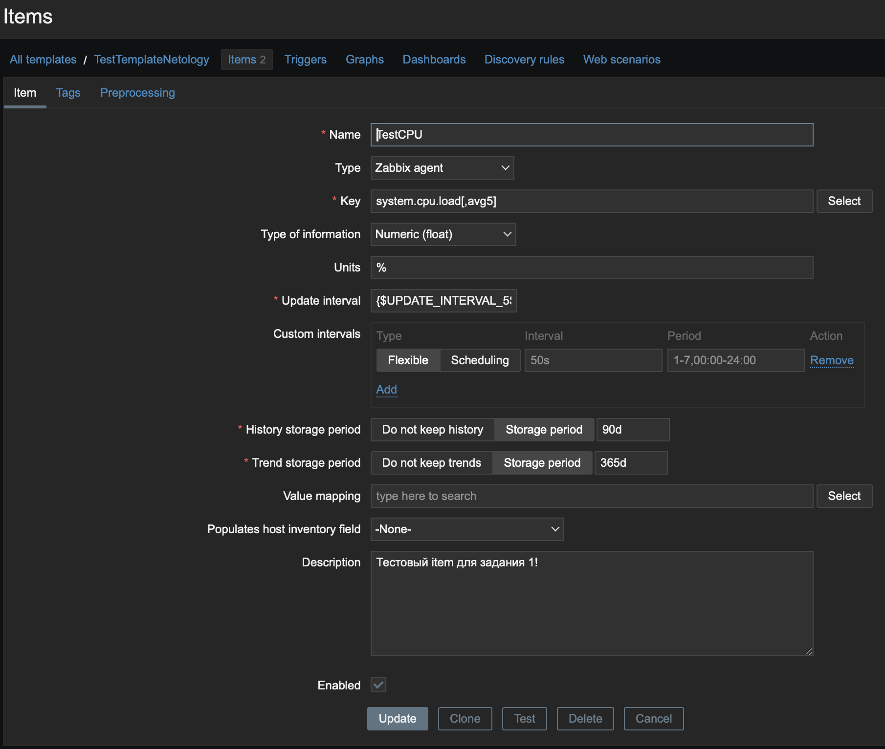
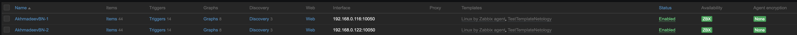

# Домашнее задание к занятию «Система мониторинга Zabbix. Часть 2.»

---
## Ахмадеев Булат Наилевич

---

## Задание 1

### В первую очередь я запустил вторую машину для теста его производительности и установил на нем Zabbix-агент:

### А также добавил его в Hosts:

### В Zabbix сервере по пути "Configuration > Templates" создал новый шаблон "TestTemplateNetology":

### С следующими макросами для удобства:

### Добавил два item'а:
 

### Проверил их работу:

---

## Задание 2 и 3

### Zabbix-агенты уже установлены на две машины (на машине из первого задания и на сервере Zabbix).
### Добавил две машины как новые хосты:

Ниже будут скриншоты привязки хостов и полученные метрики:

---

## Задание 4

### Создал два дашборда:

---
